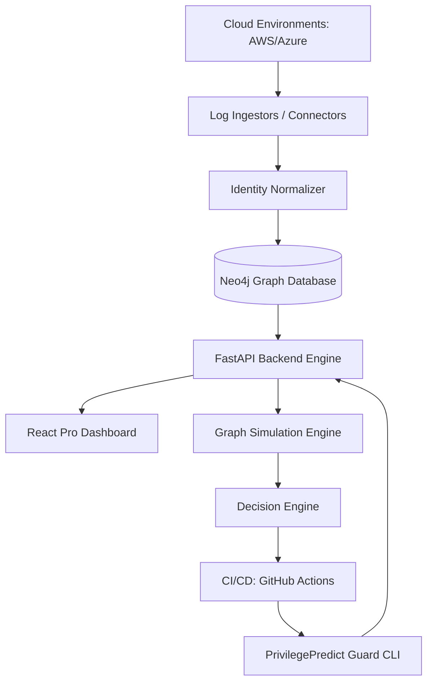

<div align="center">

# 🛡️ PrivilegePredict 🛡️
### *Predictive Multi-Cloud Identity Guard & Escalation Intelligence*

[](https://opensource.org/licenses/MIT)
[](https://www.python.org/downloads/)
[](https://reactjs.org/)
[](https://neo4j.com/)

**PrivilegePredict** is an enterprise-grade Cloud Infrastructure Entitlement Management (CIEM) platform. It shifts cloud security "left" by predicting and preventing privilege escalation paths before they reach production.

[Explore Features](#-key-capabilities) • [Get Started](#-quick-start) • [Architecture](#-architecture) • [CI/CD Guard](#-cicd-guard-prevention)

</div>

---

## 🌟 Overview

Modern cloud environments are a complex web of identities, roles, and permissions. **PrivilegePredict** provides total visibility and proactive defense across **AWS IAM** and **Azure Entra ID**. By modeling your cloud as a high-fidelity **Identity Graph**, we don't just find risks—we predict them.

### 🚀 From Visibility to Prevention
- **Phase 1: Visibility**: Deep Graph Visualization of User-to-Resource relationships.
- **Phase 2: Intelligence**: Dynamic analysis of used vs. unused permissions + Least-Privilege synthesis.
- **Phase 3: Prevention**: Hard-stop CI/CD Guard blocks risky IAM changes in Terraform/CloudFormation.

---

## 💎 Key Capabilities

### 📍 Identity Graph Visualization
Interactive Cytoscape-powered maps that expose how a single compromised "Unprivileged Role" can traverse the graph to gain `AdministratorAccess`.
- **Shortest Path Detection**: Instantly find the most dangerous escalation routes.
- **Multi-Cloud Support**: Direct ingestion and normalization of AWS and Azure identities.

### 🧠 Predictive Risk Engine (Hybrid)
A dual-layer scoring engine that combines deterministic security rules with machine learning readiness.
- **Rule Engine**: Flags sensitive actions (`iam:PassRole`, `sts:AssumeRole`) with weighted context.
- **Path Simulation**: Ephemerally injects proposed changes into the graph to see if they create *new* paths to high-value nodes.

### 🛡️ CI/CD Guard (Prevention)
Stop misconfigurations in the Pull Request. 
- **Terraform Integration**: Native parsing of `terraform plan -json`.
- **GitHub Actions Ready**: Automatically comments on PRs with risk scores and blocks "Hard Fail" violations.
- **Audit Log**: Full archival of every IAM evaluation for compliance (SOC2/ISO27001).

### 📊 SaaS Dashboard & Intelligence
A premium React-based command center for security operations.
- **Risk Heatmap**: Live KPIs on total identities, high-risk counts, and over-permissiveness.
- **Live Alert Feed**: Real-time streaming detection of high-risk IAM changes across your estate.
- **SaaS First**: Built with a multi-tenant data model and configurable risk thresholds.

---

## 🏗️ Architecture



---

## 🚀 Quick Start

### 🐳 Docker Deployment (Recommended)
The easiest way to experience the full platform:

```bash
docker-compose up -d
```
Visit the **Executive Dashboard** at `http://localhost:5173`.

### 🛠️ Developer Setup

**1. Backend (Python 3.11+)**
```bash
cd backend
pip install -r requirements.txt
uvicorn app.main:app --reload --port 8000
```

**2. Frontend (Vite + React)**
```bash
cd frontend
npm install
npm run dev
```

---

## 🤖 CI/CD Guard: Prevention in Action

To protect your cloud, add the **PrivilegePredict Guard** to your GitHub Actions:

```yaml
- name: PrivilegePredict Guard
  run: |
    python backend/cli/guard_cli.py \
      --plan plan.json \
      --tenant ${{ secrets.PP_TENANT_ID }} \
      --gh-repo ${{ github.repository }} \
      --pr-number ${{ github.event.pull_request.number }}
  env:
    GITHUB_TOKEN: ${{ secrets.GITHUB_TOKEN }}
```

---

## 🛠️ Technology Stack

| Component | Technology |
| :--- | :--- |
| **Backend** | Python 3.11, FastAPI, Pydantic v2 |
| **Database** | Neo4j (Graph), PostgreSQL (Audit) |
| **Frontend** | React 18, Vite, Cytoscape.js, CSS Glassmorphism |
| **DevOps** | Docker, GitHub Actions, Terraform CLI |
| **Analysis** | Scikit-learn, Boto3, MS Graph API |

---

## 📄 License
PrivilegePredict is released under the **MIT License**.

---

<div align="center">
Built with ❤️ 
</div>
